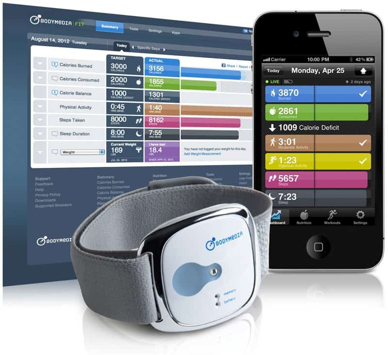

# Summary of- "Effect of Wearable Technology Combined With a Lifestyle Intervention on Long-term Weight Loss"

## Introduction

The study “Effect of Wearable Technology Combined With a Lifestyle Intervention on Long-term Weight Loss” by John M. Jakicic et al. (2016) examined whether wearable devices improve long-term weight loss in young adults. The aim was to test if adding wearable technology to a standard behavioral program leads to greater weight loss over 24 months.

## What was done

The study included 470 participants aged 18–35 with a BMI between 25 and 40. All participants completed a 6-month standard program with diet, exercise and group sessions. After that, they were randomly divided into two groups. The experimental group used a wearable device and web interface to track activity and diet, along with counseling and text prompts. The standard group received the same support but used a website for self-monitoring.

## Results 

At 24 months, contrary to the hypothesis, the standard group lost significantly more weight than the wearable group. Mean weight loss was 5.9 kg in the standard group and 3.5 kg in the wearable group. The difference was −2.4 kg (p = 0.002). Percent weight loss was also significantly higher in the standard group (6.4% vs 3.6%; p < 0.001). Both groups improved fitness, diet and activity, but there were no significant differences between them.

## Conclusion

The results suggest that wearable devices do not improve weight loss outcomes. Traditional behavioral approaches were more effective in this study.

## Why is it special to you? 

This study is relevant to me because it focuses on young overweight adults and reflects my own weight loss experience. I also used traditional methods first and later relied on wearables. Tracking increased my motivation and made activities feel more meaningful. The findings made me question whether this effect is partly psychological ("placebo effect") rather than truly improving results.

## Why is it a good example to you?

This study is a good example because it examines long-term effects over 24 months, which fills a gap in weight loss research, and includes a large sample. It provides unbiased results and challenges the common belief that wearables improve weight loss. It also has relatively low bias and uses an arm-worn device, which is believed by previous research to be generally more accurate than wrist-based trackers.

## Reference
Jakicic JM, Davis KK, Rogers RJ, King WC, Marcus MD, Helsel D, et al. Effect of wearable technology combined with a lifestyle intervention on long-term weight loss: the IDEA randomized clinical trial. J Am Med Assoc 2016 Sep 20;316(11):1161-1171. [doi: 10.1001/jama.2016.12858] [Medline: 27654602]