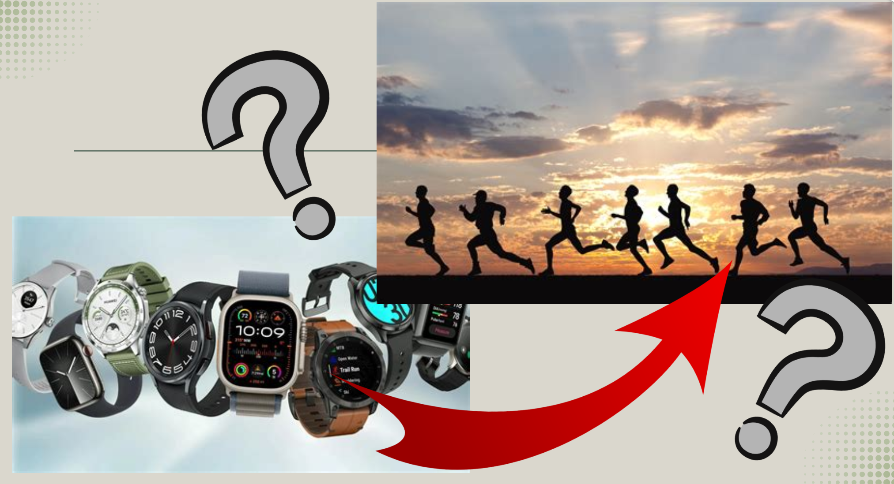

# A brief summary of:

## Consumer-Based Wearable Activity Trackers Increase Physical Activity Participation

The development of wearable digital health technologies has advanced, raising new questions for health professionals and researchers about their potential in promoting physical activity. Which types of consumer-based wearable activity trackers currently available have proven effectiveness according to scientific research and under what conditions can their benefits be fully realized? The meta-analysis by Brickwood et al (2019), "Consumer-Based Wearable Activity Trackers Increase Physical Activity Participation: Systematic Review and Meta-Analysis," investigates these questions. The study examines the impact of various interventions using wearable activity trackers on physical activity and sedentary behavior among adults in diverse populations.

### ***Introduction***

Regular physical activity is widely recognized and extensively studied as a fundamental contributor to both physical and mental well-being. Despite its proven benefits, a significant proportion of adults worldwide (31%) do not meet the minimum recommended levels of activity. Current guidelines suggest at least 30 minutes of moderate-intensity exercise on five days a week, 20 minutes of vigorous activity on three days a week, or a combination achieving at least 600 metabolic equivalent minutes weekly. In addition to insufficient physical activity, prolonged sedentary behavior defined as sitting, reclining, or lying while awake, poses serious health risks. Both inactivity and extended sedentary periods are strongly associated with adverse health outcomes, including a heightened risk of all-cause and cardiovascular mortality.

The meta-analysis under discussion examines studies that evaluate various interventions aimed at increasing physical activity. These interventions include both traditional methods and the use of modern, consumer-based wearable activity trackers.

Traditional Interventions:
Traditional approaches involve structured lifestyle programs, such as group or individual educational sessions, behavioral change strategies, self-monitoring, the distribution of written materials and telephone counseling. Research has demonstrated that such interventions can effectively boost physical activity and reduce sedentary behavior, though evidence tends to support only short-term effectiveness. The long-term impact remains insufficiently studied and these programs are often demanding in terms of labor and resources.

Consumer-Based Wearable Activity Trackers:
Wearable activity trackers, as defined in the meta-analysis, are electronic devices that objectively monitor physical activity and provide immediate feedback, such as daily step counts and energy expenditure. These trackers are readily available to the general public and are designed for easy use, typically worn on the wrist. Many devices also sync with smartphone apps or web platforms, offering a variety of motivational and tracking features to help users better manage their health. The intended advantage of these wearables is their potential to deliver ongoing, long-term support for maintaining increased physical activity, with less dependence on traditional, resource-intensive interventions.

### ***Target group***
The traget groups can be separated into primary, secondary & consumer. 

Primary are those who have professional interest in and can utilise this information. Examples of this would be  to improve processes, designs & generate new & improved services/products:
- Wearable producers
- Fitness apps (via data integration)

Secondary are those who more broadly benefit from the deepend topic understanding, and will occasionally look for the latest research in their topic of interest.
- Prosumers
	- Certain consumer subgroups while see a significant benefit to activity tracking
- Health professionals & 'experts' (typically non-licenced)
	- 'Coaches'
	- Rehab centers
    - Influencers 

The consumer group, while not the direct target, is the target audience of those primary & secondary groups. Typically the consumer group does not follow the latest research and relies on the primary and secondary to distill & repack the information in a way that is more easily acessible.

### ***What is this study about?***

In the words of the authors, this study was about undestanding and measuring "... the effects of interventions utilizing consumer-based wearable activity trackers on physical activity participation and sedentary behavior when compared with interventions that do not utilize activity tracker feedback."

Or more simply put, 'Do wearable activity trackers (ie. Fitbit, Garmin, or more loosely- your Apple Watch) actually increase how active people are'.

To do this, the authors did a systematic search of 8 different Databases, using "Medical Subject Headings (MeSH) and free text terms". Each database was searched from inception to March 15, 2017, with a total of 2597 unique studies found. To measure how effective, if at all, the use of wearables as a intervention method for increasing physical activity is, the authors put their focus on 4 different activity (1 lack there of) measures: "Daily steps", "moderate-to-vigorous physical activity (MVPA)", "energy expenditure" and "sedentary behavior".

***

### ***What are the results of the study?***
The results of the meta-analysis demonstrate that the use of wearable activity trackers leads to an increase in physical activity levels. 

For steps, MVPA, and energy expenditure, the analysis found statistically significant improvements among participants using wearables in comparison to control groups. However, it is important to note that the effect sizes for these improvements were small, with standardized mean differences (SMDs) of 0.23 for steps, 0.28 for MVPA and 0.28 for energy expenditure. In contrast, no significant effect was observed for sedentary behavior, as indicated by an SMD of -0.21.

Additionally, the quality of evidence for all four outcomes was rated as low to very low. The main reasons for this assessment were a consistently high risk of bias across all included studies, primarily because participant blinding was not feasible in these interventions. Other factors contributing to the reduced certainty of the evidence were indirectness, stemming from the heterogeneous range of interventions, comparators, populations and settings, as well as inconsistency due to observed statistical heterogeneity. Further details can be found in Table 1 of the original report.

#### **Subgroup Analysis Result**s

The meta-analysis conducted additional subgroup analyses, categorizing studies into those using wearable-based interventions and those employing multifaceted interventions:

***Daily Steps***

| Intervention type | SMD | Significance |
|---|---:|---|
| Wearable-based interventions | 0.20 | statistically significant |
| Multifaceted interventions | 0.26 | statistically significant |
||||
|Average effect size: 	|	0.23 | statistically significant |

***Moderate-to-Vigorous Physical Activity (MVPA)***

| Intervention type | SMD | Significance |
|---|---:|---|
| Wearable-based interventions | 0.17 | not statistically significant |
| Multifaceted interventions | 0.33 | statistically significant |
||||
|Average effect size: 	|	0.28 | statistically significant

***Sedentary Behavior***

| Intervention type | SMD | Significance |
|---|---:|---|
| Wearable-based interventions | -0.60 | not statistically significant |
| Multifaceted interventions | -0.08 | not statistically significant |
||||
|Average effect size: 	|-0.21   |not statistically significant 

Overall, the findings suggest that wearable activity trackers are more effective for increasing physical activity when they are combined with other traditional behavioral interventions, as seen in multifaceted approaches. However, neither intervention type showed a significant reduction in sedentary behavior.

### ***Quality of the meta-analysis?***

##### **MAGIC CRITERIA**

***Magnitude*** – How big is the effect? Large effects are more compelling
than small ones.

All reported effects were small, apart from the "Minutes per day spent in sedentary behaviours—Wearable interventions" category (effect size = -0.60). In contrast, the "Multi-faceted intervention" effect was only -0.08. While the effect size is medium-large, the wearable estimate carries a wide interval (-1.39 to 0.19) and lacks significance. Furthermore, as the studies quality was assessed as 'low' to 'very low', one should be even more cautious with ones interpretation of the result.

***Articulation*** – How specific is it? Precise statements are more compelling
than imprecise ones.

Overall the statements made in the paper are very precise. The authors achieve this through both openness & transparency, as well as providing clearly define questions, outcomes & procedures. To list a few.

 - Clearly laid out motivation for defined outcomes.
 - Clear & strucutred study selection procedures.
 - Full search strategy
    - Exclusion criteria of the studies
    - Detailed summary of study design and baseline characteristics for all included studies, with reference to each included study providing clarity on why it was included.
    - Visual(Flowchat) & text breakdown of study selection procedure in action
    - Summary of findings
    - Risk of bias summary (utilising a table based green-yellow-red risk identification system)
    - Simple representation of visual representation of results using forest plots
    - Appendeces 
        1. Full search strategy.
        2. Exclusion criteria.
        3. Detailed summary of study design and baseline characteristics for all included studies.
        4. GradePRO summary of findings table.

Additionally, an example statement:
"The results show a significant improvement in all measures of physical activity participation when compared with control groups, even when interventions were separated into wearable-based and multifaceted."

- *Generality* – How generally does it apply? More general effects are more
compelling than less general ones. Claims that would interest a more
general audience are more compelling.

Due to more broad definition of wearables, as well as inclusion of multi-faceted interventions & a differing population groups, the effects are somewhat generalisable to a variety of differing populations. In numbers:

 - 3646 participants across 9 countries
 - Wide age range (17–79 years)
 - Includes both healthy and clinical populations
 - Includes a wide range of interventions

However, this very same heterogeneity of included study designs complicates comparison and synthesis, reducing the overall quality of evidence — because differing interventions, populations, outcome measures, and follow-up periods introduce variability that obscures true effects.

- *Interestingness* – interesting effects are those that "have the potential,
through empirical analysis, to change what people believe about an
important issue". In other words, are the results relevant!

A case for relevance- the study adresses a major globabl health issue of increasing importance. It evaluates a technology who's accessibiltiy and addoption is ever increasing as well a providing a valuable data that can be fed into public health stragtegies, research, health intervention/monitoring, & even clinical reccomendations. 

A case againts- the reported effect sizes, while significant are small. Additionally, the authors attribute low confidence to these findings, particularly due to the low to very low quality if evidence used to synthesise their results. Additionally, there is a lack of long-term research on the effectiveness of wearables on improving levels of physical activity.

- *Credibility* – Credible claims are more compelling than incredible ones. 
The researcher must show that the claims made are credible.

A case for credibility- The Meta-analysis followed a systematic search methodology (PRISMA) searched multiple different databases, provided an included study risk & 'GRADE' assesmentincluded primarly, and icluded primarily 'objective' outcome studies.
Openly highlighted the shortcomings of their analysis.

A case against- There was a high risk of bias in all of the studies, unavoidable 'performance bias', low overall evidence quality, high heterogeneity of across the studies, lack of any long-term studies included in analysis- long term adherence to wearable based interventions.

***

### ***Conclusion for Research and Stakeholders***

The results of this meta-analysis suggest that consumer-based wearable activity trackers can offer small but significant benefits in increasing physical activity among adults. These devices are most effective when integrated into broader, multifaceted behavioral interventions rather than used alone. However, their impact on reducing sedentary behavior remains uncertain and was not supported by significant evidence.

For researchers:

While wearable trackers have demonstrated measurable effects in promoting activity, the overall quality of evidence is limited due to high study heterogeneity and risk of bias. Future research should focus on long-term adherence, effectiveness and strategies to improve engagement, particularly in populations at risk for inactivity.

For health professionals and policymakers:
Wearables can be a useful component of interventions aimed at increasing physical activity, especially when combined with traditional interventions like counseling or education. Their ease of use and scalable nature make them an attractive option for resource-limited settings. However, stakeholders should be aware of current evidence limitations and avoid relying solely on these devices for behavior change.

For individuals and employers:
Wearable trackers are accessible tools that can help monitor and motivate physical activity. For sustained benefits, however, ongoing support and additional behavior change strategies are recommended. Individuals looking to improve their activity levels may benefit most when combining wearables with structured programs / traditional interventions.

## Reference

Brickwood, K.-J., Watson, G., O’Brien, J., & Williams, A. D. (2019). Consumer-Based Wearable Activity Trackers Increase Physical Activity Participation: Systematic Review and Meta-Analysis. JMIR MHealth and UHealth, 7(4), e11819. https://doi.org/10.2196/11819

## Individual studies

[Individual Study AL](/study-al/)
[Individual Study NA](/study-na/)